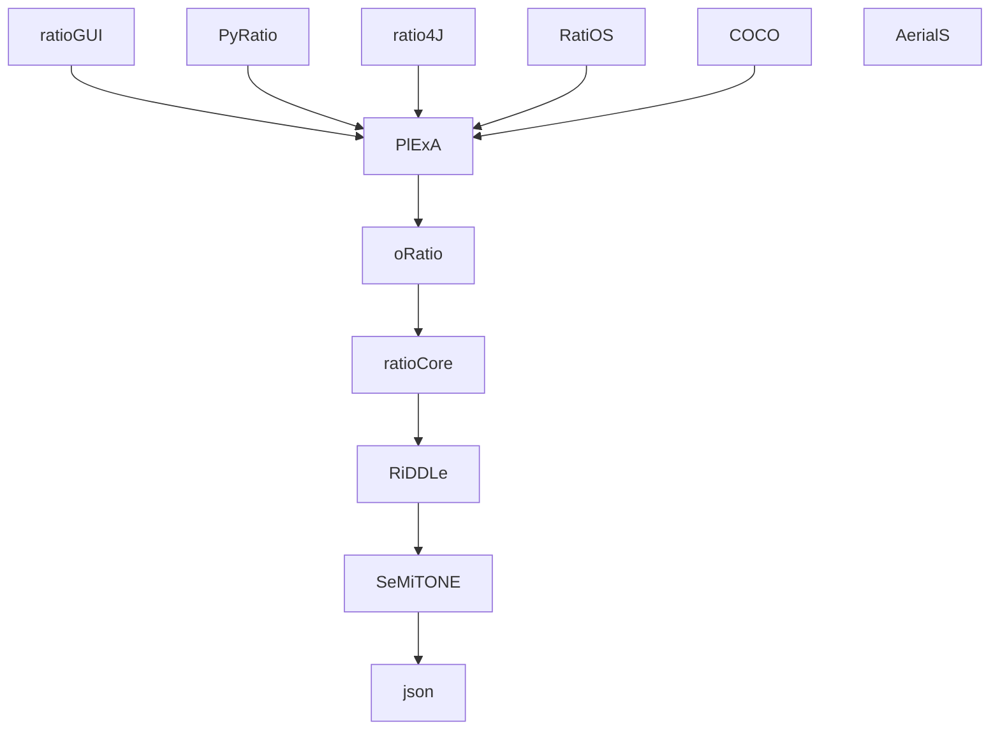

## ratioSolver

Ratio is a latin word meaning *reason*, *reasoning*, *explanation*, *plan*, etc.
Taking inspiration from the original meaning of the Latin word, this organization aims to gather a set of tools to support different forms of reasoning such as *deduction* and *abduction*, enriching them with constraint-based reasoning.

Most of the repositories are connected to each other via submodules. The following graph shows the relationships between them.

### [SeMiTONE](https://github.com/ratioSolver/SeMiTONE)

At the lowest abstraction level, the **SeMiTONE** (Satisfiability Module TheOries NEtwork) library offers, from an [SMT](https://en.wikipedia.org/wiki/Satisfiability_modulo_theories) perspective, services equivalent to those that a constraint-network offers for a [CSP](https://en.wikipedia.org/wiki/Constraint_satisfaction_problem) solver.

Based on [MiniSat](http://minisat.se), this library allows the definition and propagation of different types of constraints depending on the implemented *theories*. At the moment a *Linear Real Arithmetic (LRA)* theory is implemented, for the management of linear constraints between real variables. In addition, a *Difference Logic (DL)* theory is also available. This theory, implemented on both reals and integers, is able to impose disjunctive temporal constraints as in a disjunctive temporal network. An *Object Variable (OV)* theory allows to define (in) equality constraints between object variables. Finally, the MiniSat-based core allows for the imposition of classical propositional constraints.

It is worth noting that, as in any constraint-network, *SeMiTONE* is unable to solve Constraint Satisfaction Problems ([CSP](https://en.wikipedia.org/wiki/Constraint_satisfaction_problem)) defined on the underlying theories. Problem solving, in particular, is entrusted to an external solver which, being aware of the types of problems that has to solved, can exploit its own heuristics. *SeMiTONE*, nonetheless, allows the propagation of the solvers' choices, assigning to variables values which are consistent with the current choices. In case of inconsistencies, furthermore, *SeMiTONE* analyzes the conflicting choices, generates a *no-good*, backtracks to the first useful branch ([backjumping](https://en.wikipedia.org/wiki/Backjumping)) and adds the learnt no-good as a new constraint, thus avoiding that, in a subsequent moment of the search, the same problem occurs in another branch of the search tree.

### [RiDDLe](https://github.com/ratioSolver/RiDDLe)

The second fundamental component is the **RiDDLe** (Rational Domain Definition Language) language parser. The *RiDDLe* language takes inspiration from the DDL.1 language. The current proposal, however, introduces a pure object-oriented approach to the definition of timeline-based domains and problem definitions and, therefore, allows an higher decomposition of the domain model and an increase of modularity with a consequent reduction of the the overall complexity at design phase. Furthermore, thanks to the object-oriented approach, UML modeling features can be naturally exploited to enhance the design phase. In addition, aspects related to first order logic are further made explicit, allowing a uniform representation of planning and scheduling concepts. Finally, although the language is based on a multi-sorted first order logic core, from which the object-oriented approach comes, it has been designed for allowing extensibility and is, hence, agnostic of complex types such as state-variables or resources.

This component, specifically, allows solvers, with a minimum of implementation effort, to parse the *RiDDLe* language.

### [ratioCore](https://github.com/ratioSolver/ratioCore)

The **ratioCore** is a component that allows the management of the objects within the logical environment described by the *RiDDLe* language. This component provides the high-level functions to handle complex *RiDDLe* *types*, *methods*, *constructors*, creating new objects, etc. In other words, it provides high-level services for the management of the logical environment, relieving the solvers who use it of the burden of their management.

This component greatly simplifies the task of developing a new solver, allowing to focus solely on the search and heuristics aspects.

### [oRatio](https://github.com/ratioSolver/oRatio)

**oRatio** is an Integrated Logic and Constraint based solver that actually deals with the concrete resolution of the semantic-causal problem described in the *RiDDLe* language. This component deals with the creation and management of *flaws* and *resolvers*, their relationships, how they define a *causal graph* and how the topology of this graph can be used to define [*heuristics*](https://ecai2020.eu/papers/1484_paper.pdf) that suggest the best flaw to solve through the best resolver.

### [PlExA](https://github.com/ratioSolver/PlExA)

Once the semantic-causal problem has been solved, it must be carried out. The Plan Executor and Adaptor (**PlExA**) takes care of managing this task. Through the [callback](https://en.wikipedia.org/wiki/Callback_(computer_programming)) functions, in particular, the user of the *executor* is notified, in due time, of the various tasks to be performed.

The executor, furthermore, is able to manage any *adaptations* that, in the meantime, might have emerged from the real environment in which the plan is actually carried out. Adaptations, in particular, can concern the *delay* in starting or ending a task, the *failure* to execute a task as well as the dynamic *addition* of new requirements.

### [RatiOS](https://github.com/ratioSolver/RatiOS)

The [Robot Operating System (ROS)](https://www.ros.org) is a set of software libraries and tools that help you build robot applications. ROS represents a de-facto standard for robotics. **RatiOS** provides, through ROS [messages](http://wiki.ros.org/msg) and [services](http://wiki.ros.org/Services), the possibility to different ROS [nodes](http://wiki.ros.org/Nodes) to create semantic-causal problems, to solve them, to execute them and, if needed, to adapt them. In other words, it provides a ROS environment with the ability to use the services offered by the *executor* component. The format of the exchanged messages and services is defined within the [AerialS](https://github.com/ratioSolver/AerialS) repository.

### [ratio4J](https://github.com/ratioSolver/ratio4J)

What if C++ isn't your favorite language? **ratio4J** is a [Java](https://www.java.com) API that allows, through [Java Native Interface (JNI)](https://en.wikipedia.org/wiki/Java_Native_Interface), to interface Java software with the executor. In other words, via the *ratio4J*, a Java programmer can, once again, create semantic-causal problems, solve them, execute them and, if needed, adapt them.

This solution is particularly convenient in those situations where there is a need to use *oRatio* in a web backend environment.

### [PyRatio](https://github.com/ratioSolver/PyRatio)

Don't you even like Java? **PyRatio** is a [Python](https://www.python.org/) API that allows, through [pybind11](https://pybind11.readthedocs.io/en/stable/index.html), to interface Python software with the executor. Via the *PyRatio*, a Python programmer can create semantic-causal problems, solve them, execute them and, if needed, adapt them.

### [ratioGUI](https://github.com/ratioSolver/ratioGUI)

The last described component concerns the Graphical User Interface (GUI) of the solver. At the moment the interface is rather spartan and coarse. However, it is particularly useful for debugging semantic-causal problems. Thanks to the use of [WebSocket](https://en.wikipedia.org/wiki/WebSocket), in particular, the graphic interface allows to view, during the resolution process, the changes to the current *partial plan* and to the *causal graph* introduced dynamically as a consequence of the planner's choices. Furthermore, the [JavaScript](https://en.wikipedia.org/wiki/JavaScript) components for the visualization of the partial plan and the causal graph can be used to easily embed the generated graphs within web pages.
